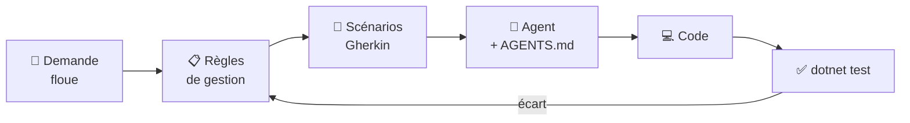

# 🎓 Fiche concept — Spécifier pour un agent

> Lire la fiche → faire l'auto-évaluation → pratiquer dans la séance.

## 1. Pourquoi la spécification redevient le cœur du travail

Un agent de code (GitHub Copilot en mode Agent, Cursor, Claude Code…) lit une
consigne, écrit le code, lance les commandes et corrige ses erreurs, seul.
Il fait **exactement ce qui est écrit**. Là où la consigne est floue, il ne
demande pas : il **choisit**, et rien ne garantit que son choix soit le bon.

Écrire du code coûte de moins en moins cher. Ce qui garde toute sa valeur :
**dire précisément ce qu'on veut**, puis **vérifier** qu'on l'a obtenu. On
parle de *développement piloté par la spécification* (*spec-driven
development*) ; des outils comme Spec Kit de GitHub l'outillent, mais le
principe tient avec trois fichiers texte.



La flèche de retour est la plus importante : **un écart se corrige dans la
spécification**, pas dans le code.

## 2. Trois niveaux de précision

| Niveau | Exemple | Qui le lit |
|---|---|---|
| **Demande** | « On prête pour deux semaines maximum. » | le client |
| **Règle de gestion** | « RG4 — La date de retour prévue est au plus tard 14 jours calendaires après la date du prêt. » | l'équipe |
| **Scénario** | « Nous sommes le 05/10/2026. Quand Julie Martin emprunte PC-01 jusqu'au 20/10/2026, alors le prêt est refusé avec le message "Un prêt ne peut pas dépasser 14 jours". » | l'équipe, l'agent **et la machine** |

Une règle est **vérifiable** si on peut dire, sur un exemple, si elle est
respectée. « Pas trop longtemps » ne l'est pas ; « 14 jours calendaires » l'est.

## 3. Gherkin : une spécification qui s'exécute

Gherkin est un langage structuré, lisible par un non-informaticien, dont
chaque ligne est reliée à du code de test. On l'écrit en français grâce à
l'en-tête `#language: fr`.

| Mot-clé | Rôle |
|---|---|
| `Fonctionnalité:` | ce que l'on décrit, avec son bénéficiaire (Afin de… En tant que… Je veux…) |
| `Contexte:` | les étapes communes à tous les scénarios du fichier (date du jour, parc) |
| `Scénario:` | **un** comportement, sur un exemple concret |
| `Étant donné que` | la situation de départ |
| `Quand` | l'action, **une seule** |
| `Alors` | le résultat observable attendu |
| `Et` | prolonge l'étape précédente |
| `Plan du scénario:` + `Exemples:` | le même scénario joué sur plusieurs lignes de données, idéal pour une limite |

**Bon et mauvais scénario**

```gherkin
# ❌ Impératif : décrit l'écran, pas la règle. Change dès qu'on change l'interface.
Scénario: Prêt
  Quand je clique sur "Nouveau prêt"
  Et je saisis "PC-01" dans le champ Code
  Et je clique sur "Valider"
  Alors je vois un message vert

# ✅ Déclaratif : décrit le comportement métier, avec des données concrètes.
Scénario: Prêter un PC disponible
  Quand Julie Martin emprunte PC-01 jusqu'au 12/10/2026
  Alors le prêt est enregistré
  Et PC-01 n'est plus disponible
```

## 4. Du Gherkin au test : Reqnroll

Reqnroll (le successeur libre de SpecFlow) transforme chaque scénario en test
xUnit. Chaque ligne est associée à une méthode C# par une expression :

```csharp
[When(@"^(.+) emprunte (PC-\d\d) jusqu'au (\d\d/\d\d/\d{4})$")]
public void Emprunte(string emprunteur, string code, string retour) { … }
```

Une ligne sans méthode associée fait **échouer** le test (message *No
matching step definition*) : tant que l'agent n'a pas écrit les étapes, les
scénarios sont rouges. C'est voulu.

## 5. `AGENTS.md` : les consignes permanentes de l'agent

`AGENTS.md` est un fichier Markdown, à la racine du projet, que les agents de
code lisent avant de travailler. Il contient ce qu'un nouveau développeur
devrait savoir le premier jour :

- **la pile technique** : .NET 10, C#, xUnit, Reqnroll ;
- **les commandes** : comment compiler, comment tester ;
- **les conventions** : noms en français, où ranger les classes ;
- **les interdits** : ne jamais modifier un fichier `.feature`, ne pas ajouter
  de paquet NuGet sans le signaler, pas de `DateTime.Now` dans le code métier ;
- **la définition de « terminé »** : une condition vérifiable par une commande
  (« `dotnet test` affiche 0 échec »).

Si votre version de VS Code ne prend pas `AGENTS.md` en compte seule, joignez-le
au message (`#file:AGENTS.md`), ou copiez son contenu dans
`.github/copilot-instructions.md`.

## 6. Relire une livraison d'agent

Trois commandes suffisent pour voir ce qui a changé :

```bash
dotnet test                    # le résultat
git diff main --stat           # l'étendue
git diff main -- "*.feature"   # le contrat a-t-il été touché ? doit être vide
```

Chaque écart entre ce qui était demandé et ce qui est livré a **une cause**
parmi quatre :

| Cause | Exemple | Ce qu'on corrige |
|---|---|---|
| **Spec ambiguë** | « deux semaines » compris comme 10 jours ouvrés | la règle, en la précisant |
| **Oubli de spec** | rien sur la date du jour : l'agent a pris `DateTime.Now` | la spec ou `AGENTS.md`, en ajoutant la contrainte |
| **Scénario faux** | le scénario attend un refus que la règle autorise | le scénario |
| **Erreur de l'agent** | la spec est claire et le code ne la respecte pas | rien dans la spec : on relance, et on le note |

La dernière cause est **la plus rare**. Quand on croit la voir, on relit
d'abord la spec.

---

## 🧮 Auto-évaluation

**Q1.** Pourquoi un agent de code est-il plus sensible qu'un humain à une demande floue ?

<details><summary>▸ Voir la réponse</summary>

Un humain pose une question ou s'appuie sur le contexte. L'agent choisit une
interprétation sans le signaler, et produit un code cohérent avec ce choix,
donc difficile à soupçonner.
</details>

**Q2.** « Un PC en retard doit être signalé. » Est-ce une règle de gestion vérifiable ? Réécrivez-la.

<details><summary>▸ Voir la réponse</summary>

Non : on ne sait pas à partir de quand un PC est en retard. Version
vérifiable : « RG8 — Un prêt non rendu est en retard à partir du lendemain de
sa date de retour prévue. »
</details>

**Q3.** Pourquoi le `Contexte` de `Prets.feature` doit-il fixer la date du jour ?

<details><summary>▸ Voir la réponse</summary>

Parce que la durée maximale et les retards dépendent de la date du jour. Sans
date fixée, le même test serait vert un jour et rouge le lendemain.
</details>

**Q4.** Quelle différence entre un `Scénario` et un `Plan du scénario` ?

<details><summary>▸ Voir la réponse</summary>

Le scénario joue un seul exemple. Le plan du scénario joue le même
enchaînement sur chaque ligne de son tableau `Exemples` : pratique pour tester
une limite (14 jours accepté, 15 refusé).
</details>

**Q5.** Pourquoi interdire à l'agent de modifier les fichiers `.feature` ?

<details><summary>▸ Voir la réponse</summary>

Parce qu'ils sont le contrat. Un agent qui n'arrive pas à faire passer un test
peut être tenté de modifier le test : tout devient vert et plus rien n'est
vérifié. `git diff main -- "*.feature"` le détecte.
</details>

**Q6.** Tous les scénarios sont verts aujourd'hui, mais le code de l'agent utilise `DateTime.Now`. Quelle est la cause, et que corrigez-vous ?

<details><summary>▸ Voir la réponse</summary>

Un oubli de spec : rien n'imposait que la date du jour soit fixable. On ajoute
dans `SPEC.md` (contraintes techniques) et dans les interdits d'`AGENTS.md` :
« la date du jour est fournie par un `TimeProvider` injecté, jamais par
`DateTime.Now` », puis on relance l'agent.
</details>

⬅️ Retour au [guide de la séance](GUIDE.md)
