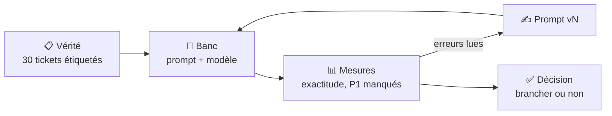

# 🎓 Fiche concept — Mesurer un LLM avant de s'en servir

> Lire la fiche → faire l'auto-évaluation → pratiquer dans la séance.

## 1. Pourquoi mesurer, et pas « essayer »

Un grand modèle de langage (**LLM**) répond toujours quelque chose, avec
aplomb. Essayer trois tickets et trouver que « ça a l'air bien » ne dit rien :
trois bonnes réponses peuvent cacher 30 % d'erreurs.

En entreprise, on ne met pas en service un modèle sur une impression. On
construit un **jeu d'évaluation** (*eval*) et on **compte**. C'est aujourd'hui
une compétence à part entière : les équipes qui intègrent l'IA passent plus de
temps à écrire leurs *evals* qu'à écrire leurs prompts.



## 2. Un LLM local : Ollama

**Ollama** fait tourner un modèle **sur votre machine** : aucune donnée ne
sort. Il expose une API HTTP sur le port `11434`.

| Commande | Effet |
|---|---|
| `ollama pull qwen2.5:1.5b` | télécharge le modèle (1 Go) |
| `ollama run qwen2.5:1.5b "…"` | pose une question en ligne de commande |
| `ollama list` | liste les modèles installés |
| `ollama serve` | démarre le serveur, s'il ne tourne pas |

Le nom `qwen2.5:1.5b` se lit : famille **Qwen 2.5**, **1,5 milliard** de
paramètres. C'est un **petit** modèle : il tourne sans carte graphique, mais
il se trompe plus qu'un gros. Mesurer permet de savoir **de combien**.

Le banc appelle l'API ainsi (vous n'avez pas à l'écrire) :

```json
POST http://localhost:11434/api/chat
{
  "model": "qwen2.5:1.5b",
  "messages": [
    {"role": "system", "content": "…votre prompt…"},
    {"role": "user",   "content": "…le ticket…"}
  ],
  "format": { …votre JSON Schema… },
  "options": { "temperature": 0 },
  "stream": false
}
```

Le **prompt système** fixe le rôle et les règles ; le message **user** porte
le ticket. Le prompt est le même pour les 30 tickets.

## 3. Contraindre la sortie : le JSON Schema

Sans contrainte, le modèle écrit de la prose : « Ce ticket relève plutôt du
matériel, priorité haute ». Un programme ne peut rien en faire.

Un **JSON Schema** décrit la forme exacte de la réponse. Passé dans le champ
`format`, Ollama **empêche** le modèle de produire autre chose : c'est ce qu'on
appelle une **sortie structurée**.

```json
{
  "type": "object",
  "properties": {
    "couleur": { "type": "string", "enum": ["rouge", "vert", "bleu"] },
    "quantite": { "type": "integer", "minimum": 1 }
  },
  "required": ["couleur", "quantite"],
  "additionalProperties": false
}
```

| Mot-clé | Rôle |
|---|---|
| `type` | le type attendu : `object`, `string`, `integer`, `boolean`… |
| `properties` | les champs de l'objet et leur propre schéma |
| `enum` | la **liste fermée** des valeurs autorisées |
| `required` | les champs obligatoires |
| `additionalProperties: false` | interdit tout champ non déclaré |

⚠️ Le schéma garantit la **forme**, pas la **justesse** : `"couleur": "rouge"`
est une réponse valide même quand la bonne réponse était `"vert"`.

> 💡 L'ordre des champs compte : le modèle écrit de gauche à droite. Un champ
> `justification` placé **avant** la priorité l'oblige à « réfléchir » avant de
> conclure. À mesurer, pas à croire.

## 4. La vérité : un jeu d'évaluation étiqueté

Pour dire qu'une réponse est fausse, il faut la **réponse attendue**, écrite
**avant** la mesure. On l'appelle l'**étiquette** (*label*), et l'ensemble,
la **vérité terrain** (*ground truth*).

Des étiquettes cohérentes demandent une **grille d'étiquetage** : une
définition vérifiable de chaque valeur. Deux personnes qui étiquettent avec la
même grille doivent tomber d'accord. Leur **taux d'accord** est le plafond
réaliste : si deux humains ne sont d'accord que sur 80 % des tickets, exiger
95 % du modèle n'a pas de sens.

## 5. Les mesures

| Mesure | Ce qu'elle dit |
|---|---|
| **Réponses exploitables** | le programme peut lire la réponse (JSON valide, valeurs connues) |
| **Exactitude** (*accuracy*) | part des réponses égales à l'étiquette |
| **P1 manqués** | incidents graves que le modèle a sous-classés : l'erreur qui **coûte** |
| **Fausses alertes** | tickets bénins classés P1 : l'erreur qui **agace** |
| **Temps par ticket** | compatible, ou non, avec l'usage |

Toutes les erreurs ne se valent pas. Une **matrice de confusion** montre
lesquelles : une ligne par valeur attendue, une colonne par valeur obtenue.

```
            obtenu
            P1   P2   P3
attendu P1   5    1    1     ← 2 P1 manqués sur 7
        P2   1    7    2
        P3   0    3   10     ← 0 P3 classé P1 : aucune fausse alerte
```

La diagonale, ce sont les bonnes réponses. Ici l'exactitude est de
(5 + 7 + 10) / 30 = 73 %, mais ce chiffre seul cache les **deux** P1 manqués.

## 6. Deux pièges de mesure

**La variabilité.** Un LLM tire chaque mot au hasard parmi les plus probables.
La **température** règle ce hasard : à 0, le modèle prend toujours le mot le
plus probable et répond (presque) toujours la même chose. Rejouer la même
mesure trois fois donne l'**écart naturel** : un « progrès » plus petit que cet
écart n'en est pas un.

**Le surapprentissage du prompt.** À force de corriger le prompt pour les
tickets qui échouent, on finit par écrire un prompt qui connaît **ces**
tickets. Le score monte, mais sur de nouveaux tickets il retombe. D'où deux
jeux :

| Jeu | On le regarde ? | On le mesure |
|---|---|---|
| **Réglage** (*dev*) | oui, autant qu'on veut | à chaque version |
| **Test** | **non** | **une fois**, à la fin |

Mettre un ticket du test dans les exemples du prompt, c'est une **fuite** : le
modèle a la réponse sous les yeux, la mesure ne vaut plus rien.

## 7. Le prompt : ce qui fait vraiment la différence

| Technique | Exemple |
|---|---|
| Donner le **rôle** et le contexte | « Tu es l'assistant de tri du service informatique d'une usine de 85 salariés. » |
| Donner la **liste fermée** des valeurs | « Catégories : poste, logiciel, reseau, acces, impression. » |
| Donner des **définitions** vérifiables | « P1 : la production est arrêtée, ou plusieurs personnes bloquées sans contournement. » |
| Dire ce qui **ne compte pas** | « Le mot URGENT ne compte pas : seules les conséquences comptent. » |
| Donner des **exemples** (*few-shot*) | 2 à 5 tickets inventés avec leur réponse JSON |

Chaque technique se **mesure** : on l'ajoute, on relance le banc, on garde si
le chiffre monte plus que l'écart naturel.

---

## ✍️ Auto-évaluation (sans regarder les réponses)

1. Le modèle répond `{"categorie": "reseau", "priorite": "P2"}` alors que
   l'étiquette est `acces`, `P2`. La réponse est-elle exploitable ? Est-elle
   juste ?
2. Pourquoi le mot-clé `enum` règle-t-il le problème des catégories inventées
   (« network », « Matériel ») ?
3. Sur 10 tickets, v1 obtient 6/10 et v2 obtient 7/10. Trois répétitions de v1
   donnent 5, 6 et 8. Peut-on dire que v2 est meilleur ?
4. Vous mettez le ticket 24 comme exemple dans le prompt, puis vous mesurez
   les tickets 21 à 30. Qu'est-ce qui ne va pas ?
5. Une matrice montre 0 fausse alerte et 3 P1 manqués sur 6. L'exactitude
   globale est de 80 %. Brancheriez-vous ce modèle pour trier **seul** ?
6. Deux collègues étiquettent les 30 tickets et ne sont d'accord que sur 24.
   Que faut-il corriger en premier : le prompt, ou autre chose ?

<details>
<summary>Réponses</summary>

1. **Exploitable oui** (JSON valide, valeurs connues), **juste non** : la
   catégorie est fausse. Le schéma garantit la première propriété, pas la seconde.
2. Parce qu'Ollama contraint la génération : le modèle **ne peut pas** écrire
   une valeur hors de la liste.
3. **Non.** L'écart naturel de v1 va de 5 à 8 : un point de plus est dans le
   bruit. Il faut plus de tickets, ou mesurer à température 0.
4. C'est une **fuite** : le ticket 24 est dans le jeu de test et dans le prompt.
   Le modèle a la réponse : la mesure sur ce ticket est sans valeur, et le score
   du test est surestimé.
5. **Non** : la moitié des incidents graves passerait en file d'attente. Le
   chiffre global de 80 % cache l'erreur qui coûte. Au mieux, le modèle propose,
   un humain valide.
6. **La grille d'étiquetage.** 20 % de désaccord entre humains signifie que la
   vérité elle-même est floue : on ne peut pas mesurer le modèle contre elle.

</details>
